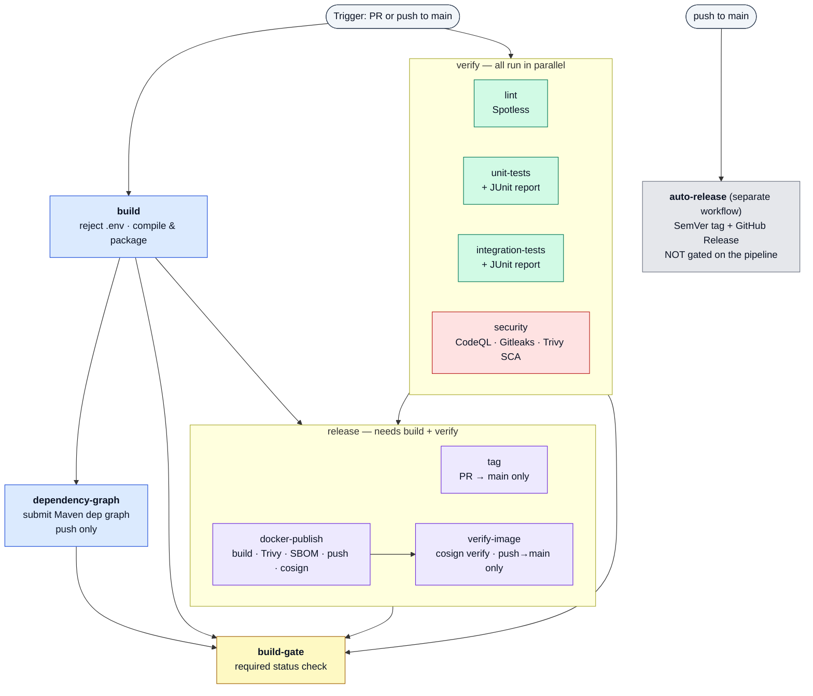

# ci-cd-template

Reusable GitHub Actions CI/CD templates for **pse-wtag** services. Consuming repos call these
workflows instead of duplicating pipeline logic.

Every pipeline stage is a self-contained
[reusable workflow](https://docs.github.com/en/actions/using-workflows/reusing-workflows)
(`on: workflow_call`), and a per-language master workflow orchestrates them. A consumer repo makes
a single call and gets build, lint, unit + integration tests, multi-layer security scanning
(SAST + secrets + dependency + image), SBOM generation, and **signed** container publishing — on
hardened, egress-controlled runners.

Every job runs behind `step-security/harden-runner` with a configurable egress policy and
`disable-sudo: true`, third-party actions are pinned to commit SHAs, checkouts use
`persist-credentials: false` unless the job genuinely pushes, and per-job `permissions` are scoped
to least privilege.

---

## Language support

This repo was originally Java-only (`java-ci-cd-template`). It has been renamed to
`ci-cd-template` because the same pipeline shape is being extended to the other stacks we run.

| Stack | Entry point | Status |
|-------|-------------|--------|
| **Java** — Maven + Spring Boot | `master-java-pipeline.yml` | ✅ Shipping — everything below documents it |
| **Angular** — pnpm + Dockerfile | `master-angular-pipeline.yml` | ✅ Shipping |
| **.NET / C#** | `master-dotnet-pipeline.yml` | 🚧 Planned |
| **Python** — pip + Django / FastAPI | `master-python-pipeline.yml` | 🚧 Planned |

See [Adding a language](#adding-a-language) for the naming contract new stacks must follow, and
what is language-agnostic and therefore already shared.

---

## Use it in your Spring Boot repo

Add **one** thin workflow to the downstream Java repo. It delegates everything to the master
pipeline:

```yaml
# .github/workflows/ci.yml  (in your Spring Boot repo)
name: CI/CD

on:
  push:
    branches: [main]
  pull_request:
    branches: [main]

# A reusable workflow can only use permissions the *caller* grants. Set these at the
# top level so the pipeline can tag, push to GHCR, upload CodeQL results, submit the
# dependency graph, and — most importantly — mint an OIDC token for keyless image
# signing (id-token).
permissions:
  contents: write        # PR build tags + dependency graph submission
  packages: write        # push image to GHCR
  security-events: write # CodeQL SARIF upload
  id-token: write        # cosign keyless signing (REQUIRED — defaults to none)
  actions: read
  checks: write

jobs:
  pipeline:
    uses: pse-wtag/ci-cd-template/.github/workflows/master-java-pipeline.yml@main
    # Forward secrets explicitly. `secrets: inherit` would hand this pipeline your
    # entire secret store, so any secret the template reads in future — including
    # one added by a compromised update — would be readable from your repo.
    secrets:
      CR_PAT: ${{ secrets.CR_PAT }}
    with:
      java-version: "25"
```

That's the whole integration. Everything below is driven from that one call.

> **Do not add a `concurrency:` block to your caller.** The master pipeline already groups by
> `${{ github.workflow }}-${{ github.ref }}` (PR runs cancel superseded runs; `main` runs always
> finish). If you must add one, give it a *different* group — otherwise the caller and the reusable
> workflow share a group and cancel each other.

> **`id-token: write` is not optional if you want signed images.** Unlike the other permissions it
> defaults to `none` even when the repo token is "read and write", so it must be granted explicitly.
> Without it, `docker-publish` still builds and pushes, but the cosign signing step fails.

### Consumer setup checklist

1. **Grant the permissions above** (especially `id-token: write`).
2. **Enable Code Scanning** (Settings → Security → Code scanning) so CodeQL runs — the stage
   self-skips cleanly when it's disabled, and *fails* if it cannot tell (see
   [Security posture](#security-posture)).
3. **Add a Maven Dependabot config** to your repo (this template ships only the `github-actions`
   half). Drop this into `.github/dependabot.yml`:

   ```yaml
   version: 2
   updates:
     - package-ecosystem: maven
       directory: "/"
       schedule:
         interval: weekly
       open-pull-requests-limit: 10
     - package-ecosystem: github-actions
       directory: "/"
       schedule:
         interval: weekly
   ```

4. **Optionally add a `.trivyignore`** at your repo root. `java-docker.yml` passes
   `trivyignores: .trivyignore` to the image scan, so that's where you park accepted base-image
   CVEs (e.g. unfixed Paketo buildpack findings).
5. **Verify signatures on deploy** (or in an admission controller) with cosign:

   ```bash
   cosign verify ghcr.io/<org>/<repo>@<digest> \
     --certificate-identity-regexp "https://github.com/<org>/<repo>/.github/workflows/.+" \
     --certificate-oidc-issuer https://token.actions.githubusercontent.com
   ```

> Forking into another org? Update the `uses:` path in the caller **and** the
> `pse-wtag/java-ci-cd-template/...@<sha>` composite-action references inside the reusable workflows
> to point at your fork. (Those internal references still carry the pre-rename repo name — GitHub's
> rename redirect keeps them resolving; see [Known gaps](#known-gaps).)

---

## Pipeline flow

The master pipeline runs **build and verify in parallel**, then `release`, behind a final gate.
Each stage is itself a reusable workflow that fans its jobs out in parallel internally:

1. **`build`** and **`verify`** start **together** — `verify` has no `needs`, so its four jobs
   (lint, unit-tests, integration-tests, security) do not wait for the build.
2. **`dependency-graph`** does `needs: build` and runs on `push` only.
3. **`release`** does `needs: [build, verify]` — so `tag` and `docker-publish` wait for the build
   *and* all four verify jobs. `docker-publish` then feeds **`verify-image`**, which on a push to
   `main` re-checks the pushed image's cosign signature before the stage may succeed.
4. **`build-gate`** does `needs: [build, dependency-graph, verify, release]` and is the single
   required status check. `skipped` is not a failure; `failure` and `cancelled` are.

**`auto-release` is a standalone workflow**, not a pipeline stage. It triggers independently on
`on: push` to `main` and is *not* gated on the pipeline result — a failing build does not stop it
from cutting a tag and Release. See [Known gaps](#known-gaps).



### Flow by event

- **Pull request → `main`:** `{ build · lint · unit · integration · security } →
  { tag · docker-publish (builds, does **not** push) } → build-gate`. No image is pushed or signed,
  so no digest exists and `verify-image` is skipped. `tag` and `docker-publish` are restricted to
  **same-repo** PRs — fork PRs skip both.
- **Push → `main`:** `{ build · lint · unit · integration · security } → dependency-graph →
  docker-publish (image → GHCR, scanned + signed) → verify-image (cosign verify) → build-gate`.
  `tag` is skipped (PR-only). `auto-release` runs in parallel, on its own trigger.

---

## The jobs

| Job | Workflow | Runs when | What it does |
|-----|----------|-----------|--------------|
| **build** | `java-build.yml` | always | Rejects tracked `.env` files (`.env.example` allowed), then `./mvnw clean package -DskipTests`. Read-only token. |
| **dependency-graph** | `java-dependency-graph.yml` | `push`, after `build` | Submits the Maven dependency graph to GitHub. Split into its own job because it needs `contents: write` — the job that compiles PR-authored code must not. |
| **lint** | `java-lint.yml` | always | Verifies code formatting with Spotless (`spotless:check`). |
| **unit-tests** | `java-unit-tests.yml` | always | Runs `mvn test` and publishes a JUnit report (`dorny/test-reporter`, non-blocking). |
| **integration-tests** | `java-integration-tests.yml` | always | Optionally exposes curated `extra-secrets` as env vars (never `GITHUB_TOKEN`), runs `mvn verify -Dsurefire.skip=true`, publishes a JUnit report. |
| **security** | `java-security.yml` | always | Three parallel scanners — **CodeQL** SAST (`java-kotlin`, manual build mode, self-skips when Code Scanning is off), **Gitleaks** secret scan over full history, and **Trivy** filesystem/dependency (SCA) scan that fails on *fixable* HIGH/CRITICAL CVEs plus a non-blocking full report (vuln + secret + misconfig). Trivy's vuln DB is cached via `actions/cache`. |
| **tag** | `tag.yml` | same-repo PR → `main` | Tags the PR build (`pr-<n>-run-<run>`) and prunes old tags for that PR (keeps the latest 4). |
| **docker-publish** | `java-docker.yml` | `push`, or same-repo PR (pushes only on `push`) | Builds an OCI image via Spring Boot Buildpacks (`pr-<n>` on PRs, `main-<sha7>` on push), resolves the pushed **digest**, **Trivy-scans** it (fails on fixable HIGH/CRITICAL, honours `.trivyignore`), emits a **CycloneDX SBOM** (Syft) as an artifact, **signs** the digest with cosign (keyless/OIDC), **attests** the SBOM to it, then prunes old GHCR images (keeps the latest 3). Outputs `image-digest`. |
| **verify-image** | `java-release.yml` (inline) | push → `main` | Runs `cosign verify` against the exact **digest** `docker-publish` pushed and signed (not a mutable tag) — asserting a keyless signature whose certificate identity matches `signer-identity-regexp` and whose OIDC issuer is GitHub Actions. Fails the release stage if the signature is missing or untrusted. |
| **build-gate** | `master-java-pipeline.yml` (inline) | `always()` | Fails the run if any of `build` / `dependency-graph` / `verify` / `release` failed or was cancelled. The single required status check. |
| **auto-release** | `auto-release.yml` | `on: push` → `main` (standalone) | Bumps a SemVer patch tag, creates a GitHub Release with generated notes, keeps the latest 10. |
| **actionlint / zizmor** | `workflow-lint.yml` | PRs + push to `main` in *this* repo | Lints this repo's own workflow YAML. Not part of the consumer pipeline. |

---

## Configuration

All inputs pass through `master-java-pipeline.yml`:

| Input | Default | Purpose |
|-------|---------|---------|
| `java-version` | `"25"` | JDK version for every stage. |
| `cache-type` | `"maven"` | Dependency-manager cache key for `setup-java`. |
| `build-egress-policy` | `"block"` | Harden-Runner egress policy for build / dependency-graph / verify (`block` = enforce allowlists, `audit` = log-only). |
| `release-egress-policy` | `"block"` | Separate Harden-Runner egress policy for the release phase (docker publish + image verify). Split out from build so the broader registry set that buildpacks reach can be tuned independently. |
| `extra-build-endpoints` | `""` | Hosts appended to the build + dependency-graph allowlists. |
| `extra-test-endpoints` | `""` | Hosts appended to the lint / unit / integration allowlists. |
| `extra-security-endpoints` | `""` | Hosts appended to the security-scan allowlist. |
| `extra-docker-endpoints` | `""` | Hosts appended to the docker-publish and verify-image allowlists. |
| `test-args` | `""` | Extra args for integration tests (e.g. `-D` properties). |
| `spring-boot-args` | `""` | Extra args for the Spring Boot image build. |
| `signer-identity-regexp` | `""` | Certificate-identity regexp `verify-image` requires of the image's keyless cosign signature. Empty defaults to `^https://github\.com/<owner>/[^/]+/\.github/workflows/`. Set it to the specific signing-workflow path for a tighter trust boundary. |

> The **base** allowlists live in each stage workflow as an `allowed-endpoints` input. The master
> pipeline deliberately exposes only the `extra-*-endpoints` inputs, so a consumer can *append*
> hosts but cannot accidentally drop the defaults. Call a stage workflow directly if you truly need
> to replace a base list.

> Egress hardening defaults to **`block`** — the allowlists are enforced. Watch the first run's
> harden-runner summary and append any denied host via the `extra-*-endpoints` inputs. Set
> `build-egress-policy: audit` to switch to log-only while you tune them.

### Secrets

The consumer forwards secrets **explicitly** (never `secrets: inherit`); the master pipeline then
passes on only what each stage needs:

- **`CR_PAT`** — GHCR push / cleanup token, forwarded explicitly to `docker-publish` (falls back to
  `github.token` when unset). Not broadcast to other stages.
- **`extra-secrets`** — optional curated JSON object (`{"NAME":"value",...}`) exposed as env vars to
  the integration tests only. Any key named `github_token` (case-insensitive) is dropped. Pass just
  what a test needs against a real external system; prefer Testcontainers so tests need no secrets
  at all. **Never** pass `toJSON(secrets)`.

---

## Repository layout

```
.github/
├── workflows/
│   ├── master-java-pipeline.yml    # Java orchestrator — the entry point Java consumers call
│   ├── java-build.yml              # Reject .env, compile & package
│   ├── java-dependency-graph.yml   # Maven dependency graph submission (push only)
│   ├── java-verify.yml             # Fan-out wrapper: lint + unit + integration + security
│   ├── java-lint.yml               # Spotless formatting check
│   ├── java-unit-tests.yml         # Unit tests + JUnit report
│   ├── java-integration-tests.yml  # Integration tests + JUnit report
│   ├── java-security.yml           # CodeQL (SAST) + Gitleaks (secrets) + Trivy (SCA)
│   ├── java-release.yml            # Fan-out wrapper: tag + docker-publish + verify-image
│   ├── java-docker.yml             # Buildpack image → Trivy → SBOM → GHCR → cosign sign/attest
│   ├── tag.yml                     # PR build tagging (language-agnostic)
│   ├── auto-release.yml            # SemVer tag + GitHub Release (standalone, push → main)
│   └── workflow-lint.yml           # actionlint + zizmor over this repo's own YAML
├── actions/
│   ├── java-setup/                 # Composite: Temurin JDK + Maven cache + MAVEN_OPTS
│   ├── ghcr-cleanup/               # Composite: GHCR image retention (with retry)
│   └── cache-cleanup/              # Composite: Actions cache retention (see Known gaps)
├── dependabot.yml                  # Weekly grouped github-actions pin bumps
└── CODEOWNERS                      # Default reviewers for every PR

.githook/
├── pre-commit                      # Local gitleaks secret scan on staged changes
└── pre-push                        # actionlint + yamllint when YAML changes are pushed

.yamllint.yml                       # Shared yamllint ruleset (hook + any CI run)
```

### Composite actions

- **`java-setup`** — installs the Temurin JDK (default **25**), enables Maven dependency caching,
  and injects tuned `MAVEN_OPTS` (G1GC, RAM %, string dedup, capped metaspace). Rejects multi-line
  `maven-opts` so the `GITHUB_ENV` write cannot inject extra variables.
- **`ghcr-cleanup`** — applies a retention policy to GHCR images (keeps the latest 3) with a
  built-in 60s retry. The owning `account` type (`user` / `org`) is configurable.
- **`cache-cleanup`** — deletes Actions caches outside the retention policy: anything not on
  `keep-ref` (default `refs/heads/main`), plus kept-ref caches older than `retention-days`
  (default 5). Needs a token with `actions: write`.

### Local git hooks

Enable them once per clone — make the hooks executable, then point git at `.githook`:

```bash
chmod +x .githook/pre-commit .githook/pre-push
git config core.hooksPath .githook
```

- **`pre-commit`** — runs `gitleaks protect --staged` to block secrets before they commit.
- **`pre-push`** — when pushed commits touch `*.yml` / `*.yaml`, runs `actionlint` and
  `yamllint --strict .` (using this repo's `.yamllint.yml`) so broken workflow definitions never
  reach GitHub.

All three tools degrade gracefully if missing (the hook warns and skips), but install them for full
protection:

```bash
# macOS / Linux (Homebrew)
brew install gitleaks actionlint yamllint

# Linux (native)
pip install yamllint
go install github.com/rhysd/actionlint/cmd/actionlint@latest
# gitleaks: grab a binary from https://github.com/gitleaks/gitleaks/releases

# Windows (Chocolatey)
choco install gitleaks actionlint
pip install yamllint   # not on Chocolatey
```

---

## Adding a language

.NET/C# and Python (pip · Django · FastAPI) pipelines follow the **same shape** as the Java one.
Nothing about the security posture is language-specific — only the toolchain steps are.

### Naming contract

One master workflow per stack, plus one reusable workflow per stage, prefixed with the stack name:

```
master-<lang>-pipeline.yml     # orchestrator: build · dependency-graph · verify · release · gate
<lang>-build.yml
<lang>-dependency-graph.yml
<lang>-verify.yml              # fan-out: lint · unit-tests · integration-tests · security
<lang>-lint.yml
<lang>-unit-tests.yml
<lang>-integration-tests.yml
<lang>-security.yml
<lang>-release.yml             # fan-out: tag · docker-publish · verify-image
<lang>-docker.yml
.github/actions/<lang>-setup/  # toolchain install + dependency cache
```

Already language-agnostic and **reused as-is** — do not fork these per stack: `tag.yml`,
`auto-release.yml`, `workflow-lint.yml`, `ghcr-cleanup`, `cache-cleanup`, `.githook/*`,
`.yamllint.yml`.

### Cross-language contract

A new master pipeline must keep these identical to the Java one so consumers and branch-protection
rules stay uniform:

- **Inputs:** `<toolchain>-version`, `cache-type`, `build-egress-policy`, `release-egress-policy`,
  `extra-{build,test,security,docker}-endpoints`, `test-args`, `signer-identity-regexp`.
- **Secrets:** `CR_PAT`, `extra-secrets` — forwarded explicitly, never inherited.
- **Job graph:** build ∥ verify → release → `build-gate` as the single required status check.
- **Outputs:** `<lang>-docker.yml` must output `image-digest` so `verify-image` can verify the exact
  artifact that was signed.
- **Hardening:** harden-runner on every job with `disable-sudo: true`, SHA-pinned third-party
  actions, `persist-credentials: false` on every checkout that doesn't push, per-job `permissions`.

### Per-stack toolchain (planned)

| Stage | Java (shipping) | .NET / C# (planned) | Python (planned) |
|-------|-----------------|---------------------|------------------|
| setup | `actions/setup-java` (Temurin) + Maven cache | `actions/setup-dotnet` + NuGet cache | `actions/setup-python` + pip cache |
| build | `mvn clean package -DskipTests` | `dotnet restore` + `dotnet build -c Release` | `pip install -r requirements.txt` (or `pyproject`) + import/compile check |
| lint | Spotless | `dotnet format --verify-no-changes` | Ruff + Black `--check` |
| unit tests | `mvn test` → JUnit report | `dotnet test` → TRX → report | `pytest` → JUnit XML report |
| integration tests | `mvn verify -Dsurefire.skip=true` | `dotnet test` (integration category) | `pytest -m integration` (Django `manage.py test` / FastAPI `httpx` client) |
| SAST | CodeQL `java-kotlin` | CodeQL `csharp` | CodeQL `python` |
| SCA | Trivy `fs` | Trivy `fs` (+ `dotnet list package --vulnerable`) | Trivy `fs` (+ `pip-audit`) |
| dep graph | `maven-dependency-submission-action` | NuGet dependency submission | `pip`/`pyproject` dependency submission |
| image | Spring Boot Buildpacks | `dotnet publish /t:PublishContainer` or Paketo | Paketo Python buildpack or a pinned distroless Dockerfile |
| secrets · image scan · SBOM · sign · verify | Gitleaks · Trivy image · Syft CycloneDX · cosign | *identical* | *identical* |

Each stack also needs its own **egress allowlist** defaults — nuget.org for .NET, pypi.org and
files.pythonhosted.org for Python — in place of the Maven Central / Spring / JBoss hosts the Java
workflows allow.

---

## Security posture

- **Hardened runners** — every job that executes real work runs `step-security/harden-runner` with a
  configurable egress policy and per-stage endpoint allowlists. Build/verify and release each carry
  their own policy (`build-egress-policy` / `release-egress-policy`), both defaulting to `block`.
  Every job also sets `disable-sudo: true`.
- **Pinned actions** — third-party actions are pinned to full commit SHAs; Dependabot keeps them
  current weekly, grouped into a single PR with a cooldown per semver bump type.
- **Self-linting workflows** — this repo's product *is* workflow YAML, so `workflow-lint.yml` runs
  `actionlint` (checksum-verified download) and `zizmor` (Actions-specific SAST: template injection,
  excessive permissions, credential persistence) over the repo on every PR, failing on medium+
  findings. The same checks run locally in `pre-push`, but hooks are skippable — CI is not.
- **Secret scanning** — Gitleaks in CI (`java-security.yml`, full history) *and* locally
  (`pre-commit`).
- **Static analysis (SAST)** — CodeQL for `java-kotlin`.
- **Dependency scanning (SCA)** — Trivy flags known CVEs in declared/transitive deps; the build fails
  on fixable HIGH/CRITICAL (`ignore-unfixed` skips un-actionable ones). A second, non-blocking Trivy
  pass reports everything the gate drops — unfixed vulns, hardcoded secrets and IaC
  misconfigurations — so they stay visible rather than silent.
- **Image scanning** — the built OCI image is Trivy-scanned before it ships, on PRs too. Accepted
  base-image findings go in the consumer's `.trivyignore`.
- **Cached vuln DB** — both Trivy scans cache the vulnerability database via `actions/cache` (keyed
  per day, with a shared restore fallback) to cut scan time and avoid rate limits. Only `main` saves
  the cache, so a PR cannot poison it.
- **Supply-chain provenance** — a CycloneDX **SBOM** per build (Syft), uploaded as an artifact **and
  attested to the pushed digest** with cosign (`cosign attest --type cyclonedx`), so the SBOM is
  cryptographically bound to the image (`cosign verify-attestation` downstream). Pushed images are
  also **signed with cosign** using keyless OIDC (no long-lived keys).
- **Signature verification (verify-then-trust)** — on push to `main`, `verify-image` runs
  `cosign verify` against the exact **digest** that was pushed and signed (not the mutable tag),
  asserting a signature whose certificate identity matches `signer-identity-regexp` and whose issuer
  is GitHub Actions. A missing or untrusted signature fails the release. Downstream deploys should
  re-run the same check at admission time (see the consumer checklist) rather than trusting the tag.
- **Scan-what-you-sign** — the pushed image's immutable digest is resolved once, right after the
  push, and that single reference drives the vulnerability scan, the SBOM, the signature and the
  attestation. Resolving by tag per-step would let the tag move in between, so what was scanned
  would not provably be what was signed.
- **Fail-closed SAST** — the CodeQL job distinguishes "code scanning is disabled for this repo"
  (HTTP 403 → warn and skip) from "the availability probe failed" (anything else → **fail**). A rate
  limit, expired token or transient 5xx fails the job rather than silently skipping analysis while
  reporting success.
- **No fork-PR privilege** — `tag` and `docker-publish` require
  `pull_request.head.repo.full_name == github.repository`, so fork PRs never get a write token or
  registry credentials.
- **`.env` guard** — the build fails if tracked `.env` files are detected (`.env.example` excepted).
- **Least privilege** — permissions are scoped per job, not globally, and consumers forward secrets
  explicitly rather than with `secrets: inherit`. The job that compiles PR-authored code holds a
  read-only token; dependency-graph submission, which needs `contents: write`, runs in a separate
  push-only job. `build-gate` runs with `permissions: {}`.

---

## Known gaps

Tracked follow-ups, listed so nobody rediscovers them the hard way:

1. **`auto-release` is not gated on the pipeline.** It fires on `on: push` to `main` independently,
   so a red pipeline still cuts a SemVer tag and GitHub Release. Folding it into
   `master-java-pipeline.yml` behind `needs: release` would close this.
2. **Internal composite-action references still use the pre-rename repo name** —
   `pse-wtag/java-ci-cd-template/.github/actions/{java-setup,ghcr-cleanup}@eab9ecc…`. GitHub's
   rename redirect keeps them working, but they should be repointed at `pse-wtag/ci-cd-template`
   (and the pin refreshed) before the redirect is relied on long-term.
3. **`cache-cleanup` is shipped but unwired** — no workflow calls it yet. It needs a scheduled
   workflow (or a `build-gate` follow-on) with `actions: write` to actually run.
4. **`java-docker.yml` references `.trivyignore`** which does not exist in this repo — it is
   expected in the *consumer* repo. Harmless when absent.
